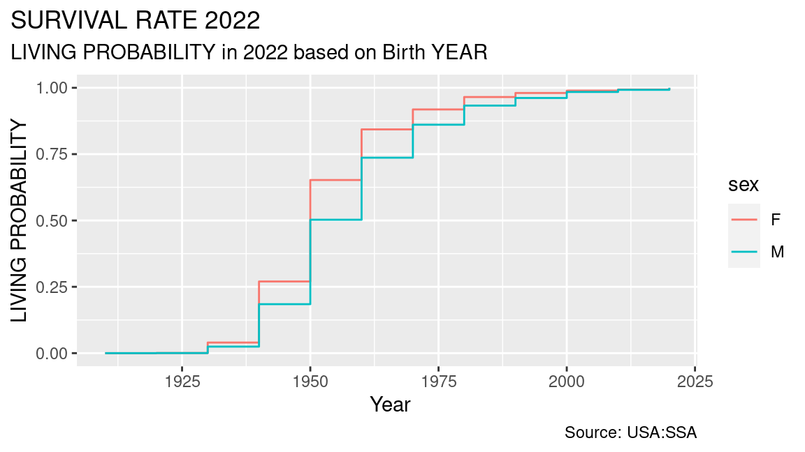
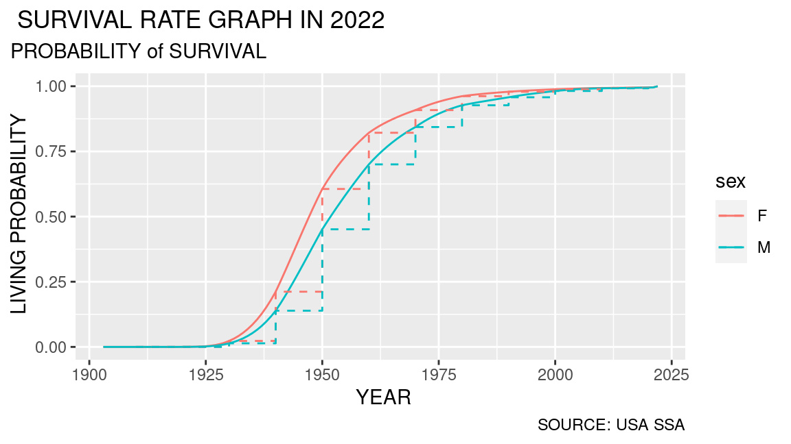
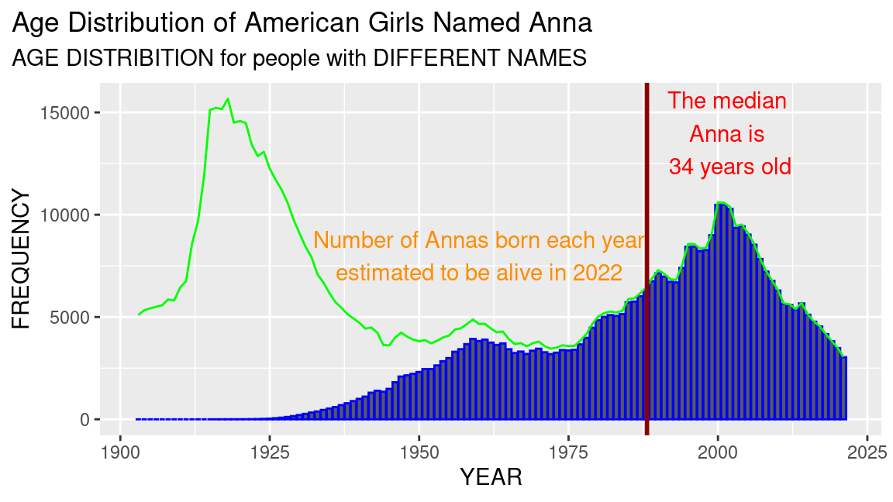
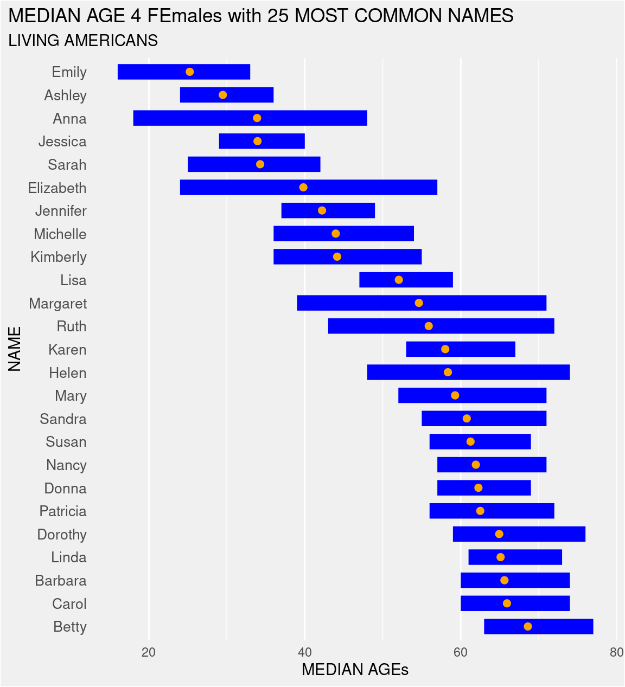

## What’s in a Name? - Estimating Age from Name


So, what more is in a name? Believe it or not, it is possible to predict
the age of a person based on their name (Whoa! Really????). In fact,
FiveThirtyEight, a popular website that focuses on data-driven
journalism, published a [blog
post](https://fivethirtyeight.com/features/how-to-tell-someones-age-when-all-you-know-is-her-name/)
on this in 2014. Wouldn’t it be exciting to try and replicate their
findings? Actually, we are going to do more than just replicate their
results, since we now have 7 years worth of additional data.


### Import Data

#### Names

Let us start by reading in the baby names data from `data/names.csv.gz`.

``` r
# Load the tidyverse package
library(tidyverse)

# Read data/names.csv.gz into a data frame named `tbl_names`
file_name_names <- here::here('data/names.csv.gz')
tbl_names <- readr::read_csv(file_name_names, show_col_types = TRUE)

# Print tbl_names
tbl_names
#> # A tibble: 2,052,781 × 4
#>     year name      sex   nb_births
#>    <dbl> <chr>     <chr>     <dbl>
#>  1  1880 Mary      F          7065
#>  2  1880 Anna      F          2604
#>  3  1880 Emma      F          2003
#>  4  1880 Elizabeth F          1939
#>  5  1880 Minnie    F          1746
#>  6  1880 Margaret  F          1578
#>  7  1880 Ida       F          1472
#>  8  1880 Alice     F          1414
#>  9  1880 Bertha    F          1320
#> 10  1880 Sarah     F          1288
#> # ℹ 2,052,771 more rows
```

#### Lifetables

In order to estimate age from a person’s name, we will additionally need
actuarial data that can tell us the chances that someone is still alive,
based on when they were born. Fortunately, the SSA provides detailed
[actuarial life
tables](https://www.ssa.gov/oact/NOTES/as120/LifeTables_Tbl_6_1990.html)
by birth cohorts for the US.

| year | age |      qx |    lx |  dx |    Lx |      Tx |    ex | sex |
|-----:|----:|--------:|------:|----:|------:|--------:|------:|:----|
| 1910 |  39 | 0.00283 | 78275 | 222 | 78164 | 3129636 | 39.98 | F   |
| 1910 |  40 | 0.00297 | 78053 | 232 | 77937 | 3051472 | 39.09 | F   |
| 1910 |  41 | 0.00318 | 77821 | 248 | 77697 | 2973535 | 38.21 | F   |
| 1910 |  42 | 0.00332 | 77573 | 257 | 77444 | 2895838 | 37.33 | F   |
| 1910 |  43 | 0.00346 | 77316 | 268 | 77182 | 2818394 | 36.45 | F   |
| 1910 |  44 | 0.00351 | 77048 | 270 | 76913 | 2741212 | 35.58 | F   |

The key column of interest to us is `lx`, which provides the number of
people born in a year who live up to a given age. The probability of
being alive can be derived as `lx` by 100,000. You can read the
documentation for the lifetables to understand what the other columns
mean.

How do we get this data in R? There are no CSV files to download. The
data is on the website of the SSA as an HTML table. Moreover, the data
for different years are on different pages. This is a very common
situation you will find yourself in as a data scientist.

Fortunately, R and the `tidyverse` has an excellent set of packages that
make it easy to scrape data from the web programmatically and bring them
into R as a table. This goes beyond the scope of this course and so I
have simply included the code I used to scrape this data.

The code below defining two functions, `read_lifetable()` and
`read_lifetables()`, which read life tables from the Social Security
Administration’s website and processes the data into a more usable
format.

``` r
read_lifetable <- function(year) {
  url <- glue::glue(
    "https://www.ssa.gov/oact/NOTES/as120/LifeTables_Tbl_6_{year}.html"
  )
  # Extract raw lifetable for year
  lifetable <- xml2::read_html(url) |> 
    # Read ALL html tables
    rvest::html_table(header = FALSE) |> 
    # Extract the second table in the list
    magrittr::extract2(2) |> 
    # Slice the first and third rows off
    slice(-c(1, 3))
  
  # Extract columns for male (1:7) and female (9:15) and stack them
  col_names <- c(unlist(lifetable[1, 1:6], use.names = F), 'ex')
  tibble(sex = c("M", "F"), cols = list(1:7, 9:15)) |> 
    mutate(table = purrr::map2(sex, cols, ~ {
      lifetable |> 
        slice(-1) |> 
        select(all_of(.y)) |> 
        set_names(nm = col_names)
    })) |> 
    select(!cols) |> 
    unnest(table) |> 
    filter(x != "") |> 
    rename(age = x) |> 
    mutate(across(!sex, parse_number))
}

read_lifetables <- function() {
  tibble(year = seq(1900, 2100, by = 10)) |> 
    mutate(lifetable = purrr::map(year, read_lifetable)) |> 
    tidyr::unnest(lifetable)
}

tbl_lifetables <- read_lifetables()
```

We already ran the code above and saved the data as
`data/lifetables.csv.gz`. Let us read it into a table named
`tbl_lifetables`.

``` r
# Read data/lifetables.csv.gz into a data frame named `tbl_lifetables`
file_names_names <- here::here('data/lifetables.csv.gz')
tbl_lifetables <- readr::read_csv(file_names_names, show_col_types = TRUE)
#> Rows: 5040 Columns: 9
#> ── Column specification ────────────────────────────────────────────────────────
#> Delimiter: ","
#> chr (1): sex
#> dbl (8): year, age, qx, lx, dx, Lx, Tx, ex
#> 
#> ℹ Use `spec()` to retrieve the full column specification for this data.
#> ℹ Specify the column types or set `show_col_types = FALSE` to quiet this message.
# Print `tbl_lifetables`
tbl_lifetables
#> # A tibble: 5,040 × 9
#>     year sex     age      qx     lx    dx    Lx      Tx    ex
#>    <dbl> <chr> <dbl>   <dbl>  <dbl> <dbl> <dbl>   <dbl> <dbl>
#>  1  1900 M         0 0.146   100000 14596 90026 4640595  46.4
#>  2  1900 M         1 0.0381   85404  3257 83776 4550569  53.3
#>  3  1900 M         2 0.0196   82147  1608 81343 4466793  54.4
#>  4  1900 M         3 0.0135   80539  1090 79994 4385450  54.4
#>  5  1900 M         4 0.0108   79449   858 79020 4305456  54.2
#>  6  1900 M         5 0.00794  78591   624 78279 4226436  53.8
#>  7  1900 M         6 0.0057   77967   444 77745 4148156  53.2
#>  8  1900 M         7 0.00407  77523   316 77365 4070411  52.5
#>  9  1900 M         8 0.00305  77207   235 77090 3993046  51.7
#> 10  1900 M         9 0.00256  76972   197 76874 3915956  50.9
#> # ℹ 5,030 more rows
```

It is always a good idea to plot the data to understand it better. Given
that this is a table of probabilities of survival, let us plot the
survival curve for a person to be alive in 2022 based on the year they
were born.

``` r
tbl_lifetables |> 
  # Filter for rows where age and year sum up to 2022
  filter(age+ year == 2020) |> 
  # Initialize a ggplot of year vs. probability of being alive (lx/10^5)
  ggplot(aes(x = year, y = (lx/10^5), color = sex)) +
  # Add a step layer
  geom_step() +
  # Add labels (title, subtitle, x, y, caption)
  labs(
    title = "SURVIVAL RATE 2022",
    subtitle = "LIVING PROBABILITY in 2022 based on Birth YEAR",
    x = " Year",
    y = "LIVING PROBABILITY",
    caption = "Source: USA:SSA"
  ) +
  # Update theme to move plot title
  theme(plot.title.position = 'plot')
```



Looking at the plot, we gather that a male born in 1950 has almost a 50%
chance of being alive in 2022. Notice that `tbl_lifetable` only has
entries for every decade. In order to figure out the distribution of
people alive, we need the probabilities for every year. One way to fill
up the gaps in the data is to use some kind of interpolation, a method
of approximating unknown values by using nearby known values. We will
extend the lifetable by adding the full sequence of years for every sex
and age combination, and then extrapolating the data to compute lx for
the newly added combinations. If you’re unfamiliar with interpolation or
would like to learn more about other ways to handle missing data, you
can check out this [10-minute Youtube
video](https://www.youtube.com/watch?v=RpxoN9-i7Jc&ab_channel=JeffreyChasnov)
by Jeffrey Chasnov on interpolation for further information.

### Transform Data

#### Manipulate Data

We can extend the lifetables this by using three useful functions:

1.  `full_seq`: Creates a full sequence of values in a vector.
2.  `complete`: Completes a data frame with missing combinations.
3.  `na.spline`: Replace `NA` with interpolated values using cubic
    interpolation.

Given that we want to interpolate for all combinations of `sex` and
`age`, we first need to group by `sex` and `age`, then use `complete`
and `full_seq` to add the missing combinations, and finally
`zoo::na.approx` to interpolate the `NA` values using cubic
interpolation. We will `ungroup` the data at the end as the grouping is
no longer necessary.

``` r
tbl_lifetables_extended <- tbl_lifetables |> 
  # Select the columns sex, age, year, and lx
  select(sex, age, year, lx) |>
  # Group by sex and age
  group_by(sex, age) |>
  # Complete the sequence of years
  complete(year = full_seq(year, period = 1)) |> 
  # Add a NEW boolean column to indicate if the data is imputed
  mutate(is_imputed = is.na(lx)) |> 
  # Interpolate missing values using zoo::na.approx
  mutate(lx = zoo::na.approx(lx)) |> 
  # Ungroup the data
  ungroup()

tbl_lifetables_extended
#> # A tibble: 48,240 × 5
#>    sex     age  year     lx is_imputed
#>    <chr> <dbl> <dbl>  <dbl> <lgl>     
#>  1 F         0  1900 100000 FALSE     
#>  2 F         0  1901 100000 TRUE      
#>  3 F         0  1902 100000 TRUE      
#>  4 F         0  1903 100000 TRUE      
#>  5 F         0  1904 100000 TRUE      
#>  6 F         0  1905 100000 TRUE      
#>  7 F         0  1906 100000 TRUE      
#>  8 F         0  1907 100000 TRUE      
#>  9 F         0  1908 100000 TRUE      
#> 10 F         0  1909 100000 TRUE      
#> # ℹ 48,230 more rows
```

We can get the probability that a person has survived till 2022 by
filtering `tbl_lifetables_extended` for rows where `year + age = 2022`.

``` r
tbl_lifetables_extended_2022 <- tbl_lifetables_extended |> 
  filter(year + age == 2022)

tbl_lifetables_extended_2022 |> 
  # Initialize a ggplot of year vs. probability of being alive (lx/10^5)
  ggplot(aes (x = year, y = lx/10^5, color = sex)) +
  # Add a line layer
  geom_line() +
  # Add a step layer for the non-imputed data
  geom_step(
    data = function(d) filter(d, !is_imputed),
    linetype = 'dashed'
  ) +
  # Add labels (title, subtitle, x, y, caption)
  labs(
    title = " SURVIVAL RATE GRAPH IN 2022 ",
    subtitle = "PROBABILITY of SURVIVAL",
    x = " YEAR",
    y = " LIVING PROBABILITY",
    caption = "SOURCE: USA SSA"
  ) +

  # Update theme to move plot title
  theme(plot.title.position = 'plot')
```



Note how imputing the data provides more realistic estimates of the
probabilities as seen by comparing the smooth curve with the steps.

#### Combine Data

Let us now join `tbl_names` with `tbl_lifetables_extended_2022` and add
two extra columns that compute the probability that the person is alive
and the number of people with that name who are expected to be alive in
that year.

``` r
tbl_names_extended <- tbl_names |> 
  # Left join with `tbl_lifetables_extended_2022` by `sex` and `year`.
  left_join(tbl_lifetables_extended_2022, by = c("sex", "year")) |> 
  # Remove any NAs in the age column
  filter(!is.na(age)) |> 
  # Add NEW column p_alive (= lx / 10^5) for probability of being alive
  mutate(p_alive= lx / 10^5) |> 
  # Remove the column `lx`
  select(!lx) |> 
  # Add NEW column nb_alive (= p_alive * nb_births) for number of people alive 
  mutate(nb_alive = p_alive * nb_births)

tbl_names_extended
#> # A tibble: 1,990,272 × 8
#>     year name      sex   nb_births   age is_imputed p_alive nb_alive
#>    <dbl> <chr>     <chr>     <dbl> <dbl> <lgl>        <dbl>    <dbl>
#>  1  1903 Mary      F         14275   119 TRUE             0        0
#>  2  1903 Helen     F          6129   119 TRUE             0        0
#>  3  1903 Anna      F          5098   119 TRUE             0        0
#>  4  1903 Margaret  F          5046   119 TRUE             0        0
#>  5  1903 Ruth      F          4517   119 TRUE             0        0
#>  6  1903 Elizabeth F          3724   119 TRUE             0        0
#>  7  1903 Marie     F          3469   119 TRUE             0        0
#>  8  1903 Florence  F          3468   119 TRUE             0        0
#>  9  1903 Ethel     F          3257   119 TRUE             0        0
#> 10  1903 Mildred   F          3088   119 TRUE             0        0
#> # ℹ 1,990,262 more rows
```

### Model Data

We now want to figure out the probability that a randomly selected
person with a certain name is alive, as well as the quantiles of their
age distribution. In particular, we will estimate the age of a female
named Gertrude. Any guesses on how old a person with this name is? How
about a male named William?

We will start by writing a function that estimates the quantiles of the
age distribution for people with a given name and sex.

``` r
# Function to estimate age statistics
estimate_age_stats <- function(tbl) {
  tbl |>
    summarize(
      # Age Quantiles
      stats = list(Hmisc::wtd.quantile(age, nb_alive)),
      # Probability of being alive
      p_alive = sum(nb_alive) / sum(nb_births),
      # Median Age: Weighted mean of age and nb_alive
      age_median = weighted.mean(age, nb_alive),
      .groups = "drop"
    ) |> 
    # Unnest the `stats` column so it stretches wide
    unnest_wider(stats)
}

tbl_names_extended |> 
  # Filter for Gertrude/F
  dplyr::filter(name == "Gertrude", sex == "F") |>
  # Estimate age stats
  estimate_age_stats()
#> # A tibble: 1 × 7
#>   `  0%` ` 25%` ` 50%` ` 75%` `100%` p_alive age_median
#>    <dbl>  <dbl>  <dbl>  <dbl>  <dbl>   <dbl>      <dbl>
#> 1      1     63     72     79    106  0.0659       68.2
```

Let us write another function that plots the age distribution for a
person based on their `name` and `sex`. We can then use this function to
visualize the age distribution for people with different names.

``` r
plot_estimated_age <- function(tbl, my_name, my_sex) {
  tbl |> 
    # Filter to keep only rows with `my_name` and `my_sex`
    filter(name == my_name, sex == my_sex) |> 
    # Add a column `age_median` with the weighted mean of age and nb_alive
    mutate(age_median = weighted.mean(age, nb_alive)) |> 
    # Initialize a ggplot with x = year
    ggplot(aes(x = year)) +
    # Add a column layer with y = nb_alive, and appropriate colors
    geom_col(aes (y = nb_alive), color = 'blue') +
    # Add a line layer with y = nb_births, and appropriate colors
    geom_line(aes (y = nb_births), color = 'green') +
    # Add a vertical line for the median age
    geom_vline(
      aes(xintercept = 2022 - age_median), 
      color = 'darkred',
      linewidth = 1
    ) +
    # Add labels (title, subtitle, x, y)
    labs(
      title = glue::glue('Age Distribution of American Girls Named {my_name}'),
      subtitle = "AGE DISTRIBITION for people with DIFFERENT NAMES",
      x = "YEAR",
      y = "FREQUENCY",
    ) +
    # Add an annotation for number of people estimated to be alive
    annotate(
      geom = 'text',
      x = 1960,
      y = 8000,
      label = glue::glue(
        "Number of {my_name}s born each year\nestimated to be alive in 2022"
      ),
      color = 'darkorange'
    ) +
    # Add an annotation for median age.
    geom_text(
      data = function(x) {head(x, 1)},
      x = 2002,
      y = 14000,
      aes(label = glue::glue(
        "The median \n {name} is \n {round(age_median, 0)} years old"
      )),
      color = 'red'
    ) +
    # Update theme to move plot title
    theme(plot.title.position = 'plot')
}

tbl_names_extended |> 
   plot_estimated_age("Anna", "F")
```



Let us now get the top 25 most popular names for Females.

``` r
# slice_max()# Create `tbl_names_female_top_25` with name and sex for top 25 females
tbl_names_female_top_25 <- tbl_names |>
  # Group by sex and name
  group_by(sex, name) |>
  # Summarize total number of births
  summarize(total_births = sum(nb_births), .groups = "drop") |>
  
  # Remove column nb_births as PER ABOVE STATEMENT 
  # Filter only Females
  filter(sex == "F") |>
  # Slice top 25 rows
  slice_max(order_by = total_births, n=25) |>
  # Select name and sex
  select(name, sex)
# Print `tbl_names_female_top_25`
tbl_names_female_top_25
#> # A tibble: 25 × 2
#>    name      sex  
#>    <chr>     <chr>
#>  1 Mary      F    
#>  2 Elizabeth F    
#>  3 Patricia  F    
#>  4 Jennifer  F    
#>  5 Linda     F    
#>  6 Barbara   F    
#>  7 Margaret  F    
#>  8 Susan     F    
#>  9 Dorothy   F    
#> 10 Sarah     F    
#> # ℹ 15 more rows
```

Let us join `tbl_names_extended` with `tbl_names_female_top_25` so that
we only keep rows corresponding to the top 25 female names.

``` r
tbl_names_extended_age <- tbl_names_extended |> 
  # Inner join the `tbl_names_female_top_25` table by `sex` and `name`
  inner_join(tbl_names_female_top_25, by = c("sex", "name")) |>
  # Group by name and sex
   group_by(name, sex) |>
  # Estimate age stats
  estimate_age_stats() |> 
  # Arrange the data based on median age
   arrange(age_median) |>
  # Clean the names
  janitor::clean_names()

tbl_names_extended_age
#> # A tibble: 25 × 9
#>    name      sex   x0_percent x25_percent x50_percent x75_percent x100_percent
#>    <chr>     <chr>      <dbl>       <dbl>       <dbl>       <dbl>        <dbl>
#>  1 Emily     F              1          16          24          33        104. 
#>  2 Ashley    F              1          24          31          36         90.5
#>  3 Anna      F              1          18          29          48        106. 
#>  4 Jessica   F              1          29          35          40        105. 
#>  5 Sarah     F              1          25          34          42        104. 
#>  6 Elizabeth F              1          24          39          57        105. 
#>  7 Jennifer  F              1          37          43          49         95.7
#>  8 Michelle  F              1          36          47          54        103. 
#>  9 Kimberly  F              1          36          48          55         88.4
#> 10 Lisa      F              1          47          54          59        101. 
#> # ℹ 15 more rows
#> # ℹ 2 more variables: p_alive <dbl>, age_median <dbl>
```

We can now replicate the plot published by FiveThirtyEight by adding a
point for the median age and a segment to represent the 25th and 75th
percentiles.

``` r
tbl_names_extended_age |> 
  # Reorder name based on descending median age 
  mutate(name = fct_reorder(name, desc(age_median))) |> 
  # Initialize a ggplot of age_median vs. name
  ggplot(aes(x = age_median, y=name)) +
  # Add a segment layer: x = x25_percent, xend = x75_percent and y_end = name
  geom_segment(
    aes(
      x = x25_percent,
      xend =  x75_percent,
      yend = name
    ),
    color = "blue",
    linewidth = 5
  ) +
  # Add a point layer:
  geom_point(size = 2, color = "orange") +
  # Add labels (title, subtitle, x, y)
  labs(
    title = "MEDIAN AGE 4 FEAMLES with 25 MOST COMMON NAMES",
    subtitle = "LIVING AMERICANS",
    x = "MEDIAN AGE",
    y = "NAME"
  ) +
  # Update theme to clean up visual appearance of the plot
  theme(
    axis.text.y = element_text(size = 10),
    plot.title.position = 'plot',
    axis.ticks = element_blank(),
    panel.grid.major.y = element_blank(),
    plot.background = element_rect(fill = '#f0f0f0'),
    panel.background = element_rect(fill = '#f0f0f0')
  )
```


